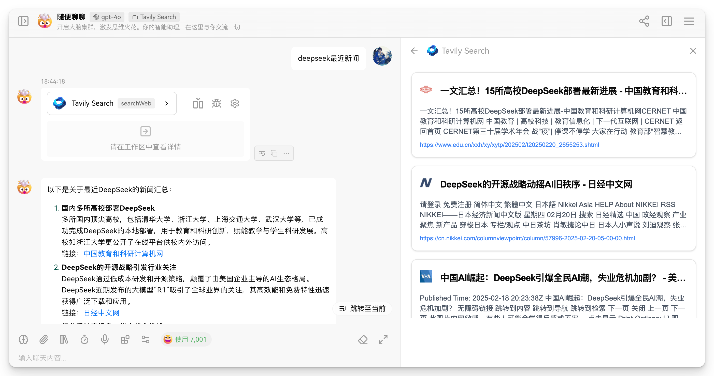

# LobeChat Tavily AI Search Plugin

  

**English** · [简体中文](./README.zh-CN.md) 

<h3 align="center">
  Enhance LobeChat with Real-Time AI-Powered Web Search using Tavily AI Search API 
  
</h3>

## 🌟 Why Choose Tavily AI Search Plugin for LobeChat

- 1,000 free searches per month without credit card requirement
- Educational accounts can apply for free trial (4,000 credits/month for 4 months)

## 🚀 Quick Start

### Step 1: Get API Key

1. Visit [Tavily Official Website](https://tavily.com/) to register an account.

2. Create **API Keys** on the dashboard.

3. Copy the generated API key for later use.

### Step 2: Install Plugin 

In LobeChat, follow these steps：

1. Click **Plugin Store** -> **Custom Plugin** -> **Edit Installation File**.

2. Add `https://lobe-plugin.composere.com/manifest.json` to **Description File URL**.

3. Click **Install Plugin**.

Note: `https://lobe-plugin.composere.com/manifest.json` is deployed on Vercel. For private deployment, refer to the guide below.

## ⚙️ Private Deployment

If you're concerned about API key security with public API endpoints, you can deploy your own instance:

1. Fork this project and deploy to Vercel with one click.

2. Modify the `url` field in `manifest.json` from `https://lobe-plugin.composere.com` to your deployed domain.

3. Modify the `ui` field in `manifest.json` from `https://lobe-plugin.composere.com` to your deployed domain.

4. For custom gateway configuration, refer to `manifest-dev.json` and update the `gateway` field from `http://localhost:3000` to your domain.

## 🎨 Upcoming Features

1. **Extended Tavily API Parameters Support**
   - Search type customization (web search, news search, etc.)
   - Result maximum length configuration
   - Search response format optimization
   - Advanced filtering options

2. **Enhanced User Interface**
   - Result preview features

3. **Performance Optimizations**
   - Caching mechanism
   - Response speed improvements

## 🙏 Acknowledgments

- LobeChat - The amazing AI chat platform
- Tavily AI - For providing the powerful search API

## 📝 Notes

- This plugin requires a valid Tavily API key to function.
- Make sure to keep your API key secure and never commit it to version control.

Made with ❤️ for the LobeChat community

