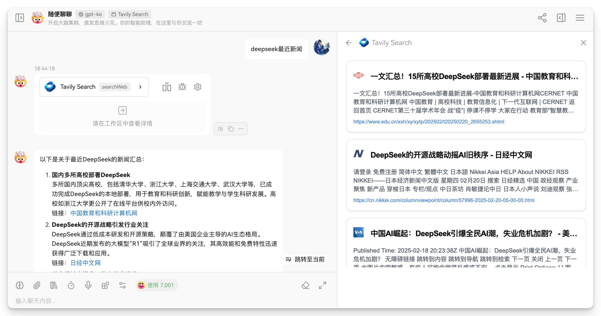

# Lobe Chat Tavily Search Plugin

  

<h3 align="center">
  基于 Tavily AI Search API 的强大 LobeChat 搜索插件
  
</h3>

## 🌟 为什么选择 Tavily

- 官方每个月 1000 次免费搜索，无需信用卡
- edu 教育账号可申请免费试用（4000 信用积分/月，共 4 个月）

## 🚀 快速开始

### 第一步：获取 API 密钥

1. 访问 [Tavily 官网](https://tavily.com/) 注册账号

2. 在主页创建 **API Keys**

3. 复制生成的 API 密钥备用

### 第二步：安装插件

在 LobeChat 中操作：

1. 点击 **插件商店** -> **自定义插件** -> **编辑安装文件**

2. 在**描述文件 URL** 添加 `https://lobe-plugin.composere.com/manifest.json`

3. 点击**安装插件**

注意：`https://lobe-plugin.composere.com/manifest.json` 部署在 Vercel 上，如果你想私有化部署，参考下面教程。

## ⚙️ 私有化部署

如果你担心部署的公共 API 接口会泄露你的 API key，你可以 fork 本项目后自行部署，参考以下步骤：

1. fork 本项目后，Vercel 一键部署

2. 修改 `manifest.json` 文件中的 `url` 字段中的 `https://lobe-plugin.composere.com` 为你的自部署域名

3. 修改 `manifest.json` 文件中的 `ui` 字段中的 `https://lobe-plugin.composere.com` 为你的自部署域名

4. 目前走的是官方网关，如果你想自定义网关，参考 `manifest-dev.json` 配置文件，需要修改 `gateway` 字段中的 `http://localhost:3000` 为你的自部署域名

## 🎨 即将推出的功能

1. **Tavily API 参数扩展支持**
   - 搜索类型自定义（网页搜索、新闻搜索等）
   - 结果最大长度配置
   - 搜索响应格式优化
   - 高级筛选选项

2. **增强用户界面**
   - 结果预览功能

3. **性能优化**
   - 缓存机制
   - 响应速度提升

## 🙏 致谢

- LobeChat - 出色的AI对话平台
- Tavily AI - 提供强大的搜索 API

## 📝 注意事项

- 插件需要有效的 Tavily API 密钥才能运行

- `确保 API 密钥安全，切勿提交到版本控制系统中`
  

为 LobeChat 社区用 ❤️ 制作

